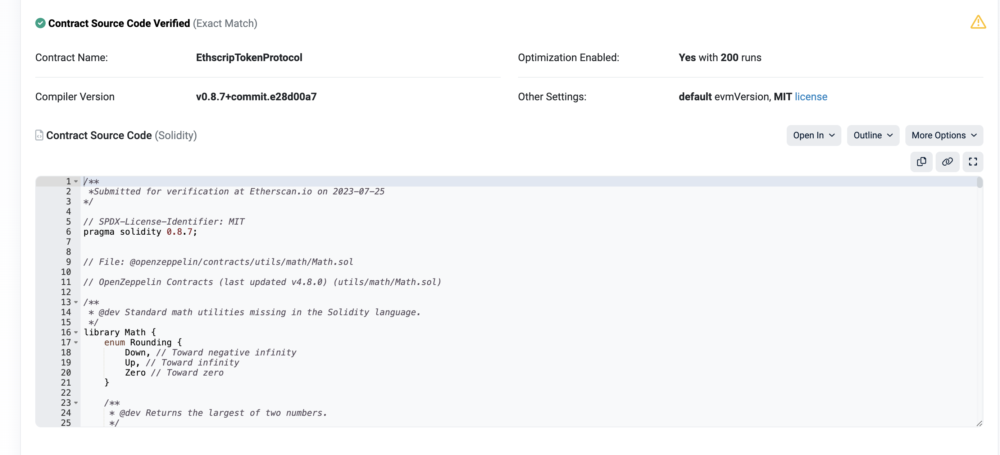

# EthscripTokenProtocol 

EthscripTokenProtocol is a protocol designed to implement token splitting for Ethscription. 
The split tokens are fully compatible with ERC20 and can be traded on Uniswap. 
The splitting process is reversible, and the split tokens can still be converted back to ethscription, depending on the user's choice. 
The Ethereum ecosystem is enormous, but currently it is difficult for Ethscriptions to integrate into it. The emergence of EthscripTokenProtocol solves this problem. 

## It has the following characteristics: 
1. Ethscriptions are permanently existent and will never disappear. 
2. Users can choose to split Ethscriptions into tokens that enter the Ethereum ecosystem. 
3. Users can choose to reverse tokens back into Ethscriptions, and the tokens will be automatically destroyed. 
4. Splitting is based on Ethscriptions, such as Eths ethscriptions. There are a total of 21,000 valid ethscriptions, with each ethscriptions corresponding to 1,000 tokens. The maximum number of tokens that can be split is 21,000,000. 
5. The splitting process is executed in a decentralized manner on the blockchain, and anyone can query and verify it. 

## Implementation 
 

## Description 
EthscripTokenProtocol is not just a simple mapping relationship, it can be understood as a bridge for asset flows. Mapping refers to the statistics of user addresses and the simple rule of sending tokens. 
EthscripTokenProtocol is an automatically handled bridging protocol for asset inflows and outflows. Theoretically, EthscripTokenProtocol can support any Ethscriptions entering the Ethereum ecosystem, and implemented reversible inversion. Therefore, EthscripTokenProtocol is opening the doors to a magical world for Ethscriptions to enter the Ethereum ecosystem. Most importantly, it executes on-chain in a decentralized manner. Anyone can attempt to verify it. 

## Contract Code 
https://github.com/EthsMarket/EthscripTokenProtocol_Contract 

## Contract Deploy 
https://etherscan.io/address/0x1ab5c8bde1b58a81ae59bdb459d7e1273abadf4b 
https://etherscan.io/token/0xbc84df7760c3cd3236c7f1b372535a6eaa7619cd 

### Verification 
We choose to verify the code using Sourcify. 
Sourcify is an Ethereum official code verification tool, you can find it here. 
https://github.com/ethereum/sourcify 

https://repo.sourcify.dev/select-contract/ 

 
 

### Contract security 
The security of the contract is completed by me and Tom Lehman, Ethscriptions Protocol creator. If you find any issues, please let us know. 

## Token splitting of $eths
The splitting of $eths is completely based on the collection. The collection of $eths has been opened to the public before the launch on the mainnet, and anyone can query and verify it. 
https://github.com/EthsMarket/eths_collection 
 
There are a total of 21,000 valid ethscriptions, with each ethscriptions corresponding to 1,000 tokens. The maximum number of tokens that can be split is 21,000,000. 
The total supply will never be greater than 21,000,000.
